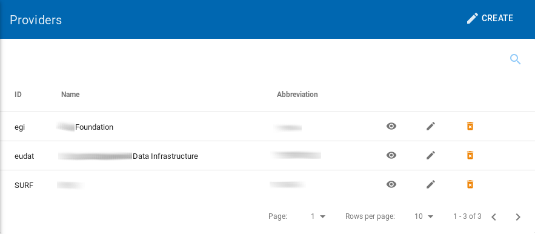
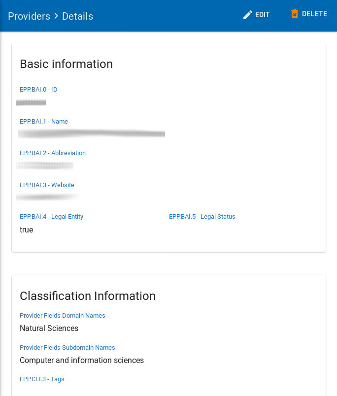
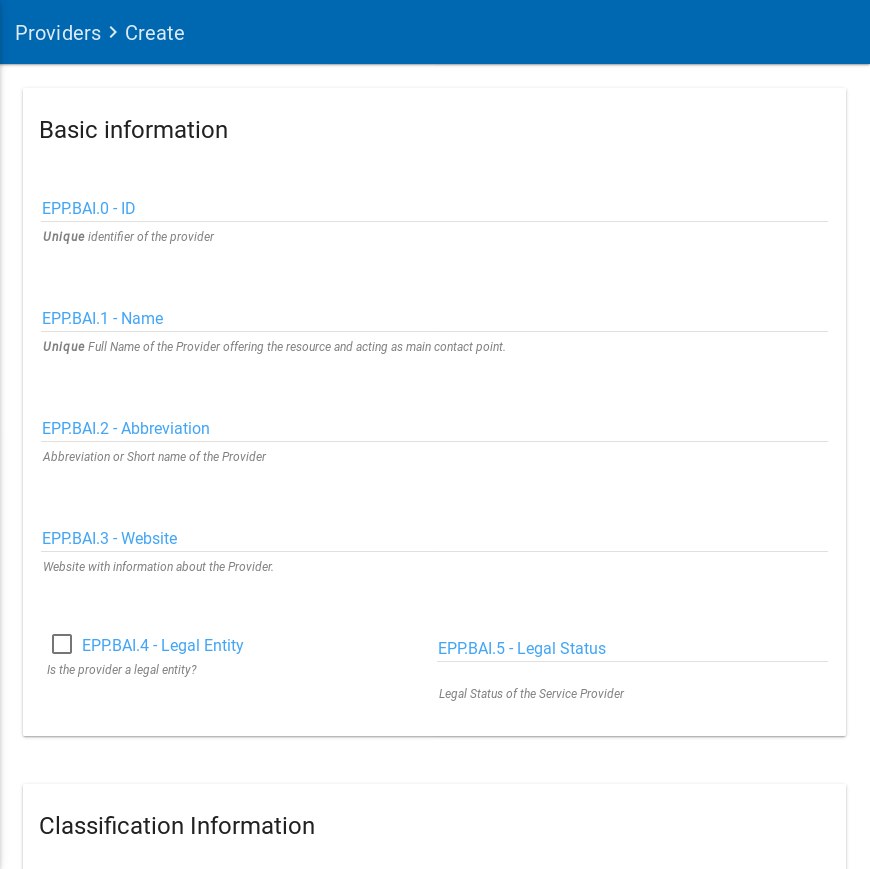

**Provider**: A Provider is  System User responsible for the provisioning of one or more Resources to users. Providers are organisations,
a part of an organisation or a federation that manages and delivers Resources to End-Users. Providers can be:

1.  Resource Providers,
2.  Service Providers,
3.  Data (Source) Providers,
4.  Service Developers,
5.  Research Infrastructures,
6.  Distributes Research Infrastructures,
7.  Resource Aggregators,
8.  Thematic Clouds,
9.  Regional Clouds, etc.

## List Providers 
To view the list of all providers, the user must click to the **Providers** left sidebar menu option.

|  |
|:--------------------:|
| *The providers page* |

## Provider Details
The user can view all the information from a selected provider by clicking on the details view  icon.

|  |
|:--------------------:|
| *The details from a provider* |

## Create a new Provider
To create a new Provider, a `superadmin`, `admin` or `Service Admin` user must click to the **Providers** left sidebar menu option.

When the user clicks to the Providers option, a new page with the list of existing Providers is presented.

From this page a user may create a new provider just by clicking the **Create** option on the top right.

|  |
|:--------------------------:|
| *Create new provider page* |

In this new page the `superadmin`, `admin` and `Service Admin` user have to fill a number of fields in order to provide the provider details.

As you can see, each field has its own detailed description of what kind of data is expected to be filled in by the user.

Below is the list of fields with small descriptions of the fields. The required fields are also mentioned in this table.

| Field Name                  | Description                                                                                   |
| --------------------------- | --------------------------------------------------------------------------------------------- |
| **Basic information**       |                                                                                               |
| EPP.BAI.0 - ID (**required**)							|	Unique identifier of the Provider															|
| EPP.BAI.1 - Name (**required**)								|	Full Name of the Provider offering the resource and acting as main contact point.			|
| EPP.BAI.2 - Abbreviation (**required**)						|	Abbreviation or short name of the Provider.													|
| EPP.BAI.3 - Website						|	Webpage with information about the Provider.												|
| EPP.BAI.4 - Legal Entity					|																								|
| EPP.BAI.5 - Legal Status					|	Legal status of the Provider. The legal status is usually noted in the registration act/statutes. For independent legal entities (1) - legal status of the Provider. For embedded providers (2) - legal status of the hosting legal entity. It is also possible to select Not a legal entity.	|
|**Classification Information**											|																								|
| EPP.CLI.1 - Scientific Domain	(**required**)				|	A named group of providers that offer access to the same type of resource or capabilities.	|
| EPP.CLI.2 - Scientific Subdomain (**required**)				|	A named group of providers that offer access to the same type of resource or capabilities, within the defined domain.	|
| EPP.CLI.3 - Tags							|	Keywords associated to the Provider to simplify search by relevant keywords.				|
| **Location information**												|																								|
| EPP.LOI.1 - Street Name and Number (**required**)			|	Street and Number of incorporation or Physical location of the Provider or its coordinating centre in the case of distributed, virtual, and mobile providers.	|
| EPP.LOI.2 - Postal Code (**required**)						|	Postal code of incorporation or Physical location of the Provider or its coordinating centre in the case of distributed, virtual, and mobile providers.	|
| EPP.LOI.3 - City	(**required**)							|	City of incorporation or Physical location of the Provider or its coordinating centre in the case of distributed, virtual, and mobile providers.	|
| EPP.LOI.4 - Region						|	Region of incorporation or Physical location of the Provider or its coordinating centre in the case of distributed, virtual, and mobile providers.	|
| EPP.LOI.5 - Country or Territory (**required**)				|																								|
| **Marketing Information** 							|																								|
| EPP.MRI.1 - Description	(**required**)					|	The description of the Provider.															|
| EPP.MRI.2 - Logo		(**required**)						|	Link to the logo/visual identity of the Provider.											|
| EPP.MRI.3 - Multimedia					|	Link to video, slideshow, photos, screenshots with details of the Provider.					|
| EPP.MTI.1 - Life Cycle Status				|	Current status of the Provider/Research infrastucture life-cycle.							|
| EPP.MTI.2 - Certifications				|	List of certifications obtained for the Provider (including the certification body and any certificate number).	|
| Main Contact/Resource Owner				|																								|
| Public Contact							|																								|
| EPP.OTH.1 - Hosting Legal Entity			|	Name of the organisation/institution legally hosting (housing) the provider/research infrastructure or its coordinating centre. A distinction is made between: (1) research infrastructures that are self-standing and have a defined and distinct legal entity, (2) research infrastructures that are embedded into another institution which is a legal entity (such as a university, a research organisation, etc.). If (1) - name of the research infrastructure, If (2) - name of the hosting organisation.	|
| EPP.OTH.2 - Participating Countries		|	Providers/Research Infrastructures that are funded by several countries should list here all supporting countries (including the Coordinating country).			|
| EPP.OTH.3 - Affiliations					|																								|
| EPP.OTH.4 - Networks						|	Select the networks the Provider is participating in.										|
| EPP.OTH.5 - Structure Type				|	Defines the Provider structure type (single-sited, distributed, mobile, virtual, etc.)		|
| EPP.OTH.6 - ESFRI Domain					|	ESFRI domain classification.																|
| EPP.OTH.7 - ESFRI Type					|	If the research infrastructure is (part of) an ESFRI project indicate how the RI participates: a) is a node of an ESFRI project, b) is an ESFRI project, c) is an ESFRI landmark, d) is not an ESFRI project or landmark.	|
| EPP.OTH.8 - MERIL Scientific Domain		|																								|
| EPP.OTH.9 - MERIL Scientific Subdomain	|																								|
| EPP.OTH.10 - Areas of activity			|	Basic research, Applied research or Technological development								|
| EPP.OTH.11 - Societal Grand challenges	|	Provider’s participation in the grand societal challenges as defined by the European Commission	|
| EPP.OTH.12 - National Roadmaps			|	Provider being part of a national roadmap for research infrastructures						|

## Edit a Provider

The `superadmin`, `admin` and `Service Admin` have the permission to edit a Provider.

To edit an existing Provider, the user should visit the list of Providers.

By clicking on the edit  icon near the selected provider the user can edit the details of it.

The fields that the user can change are the same as the ones described in the previous section "Create new provider" .

## Delete a Provider

The `superadmin`, `admin` and `Service Admin` have the permission to delete a Provider.

To delete an existing Provider, the user should visit the list of Providers. By clicking on the delete  icon near the selected provider  
the user can delete it.

|  |
|:--------------------------:|
| *The page will show you a confirmation message and if you agree, then this entry will be deleted.* |
